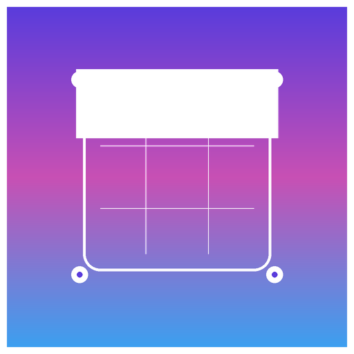

<picture>
  <source media="(prefers-color-scheme: dark)" srcset="Sources/Stag/Resources/icon_256x256@2x.png">
  
</picture>

# Stag

> A powerful, privacy-first macOS screenshot and screen recording tool — built entirely with Swift and Apple frameworks. No telemetry. No accounts. No cloud. Your data stays on your Mac.

[](https://swift.org)
[](https://developer.apple.com/macos)
[](LICENSE)
[](#privacy)

---

## Privacy

**Stag has zero third-party dependencies and makes zero unsolicited network requests.**

| Claim | Verified |
|---|---|
| No analytics or telemetry | ✅ No Amplitude, Mixpanel, Segment, Firebase, or any analytics SDK |
| No crash reporters | ✅ No Sentry, Crashlytics, or Bugsnag |
| No tracking pixels or beacons | ✅ The only network code is `ImageUploader.swift` — user-configured, opt-in, points to your own endpoint |
| No third-party dependencies | ✅ `Package.resolved` does not exist — only Apple system frameworks are imported |
| Data stored locally | ✅ History in `~/Library/Application Support/Stag/`, preferences in `UserDefaults` |
| Open source | ✅ MIT license — read every line |

The complete list of imported frameworks: `AppKit`, `AVFoundation`, `Carbon`, `Cocoa`, `Combine`, `CoreGraphics`, `CoreImage`, `CoreMedia`, `Foundation`, `ImageIO`, `OSLog`, `ScreenCaptureKit`, `SwiftUI`, `UniformTypeIdentifiers`, `Vision`. All Apple, all auditable.

---

## Features

### Capture

| Mode | Description |
|---|---|
| **Area** | Crosshair overlay with blue selection border. `Capture immediately` mode skips the resize step. |
| **Window** | Click to capture a specific window, with optional drop shadow |
| **Fullscreen** | All displays at once |
| **Scrolling** | Auto-scrolls a window and stitches the frames into one tall image (requires Accessibility permission) |
| **Self-Timer** | 3 s / 5 s / 10 s countdown |
| **Freeze Screen** | Desktop freezes before the overlay appears |
| **Hide Desktop Icons** | Toggle off clutter before capturing |

### Recording

| Feature | Description |
|---|---|
| **Screen Recording** | System audio + optional microphone, hardware-accelerated H.264/HEVC encoding |
| **GIF Recording** | Floyd-Steinberg dithering, 216-colour palette, up to 50 fps |
| **Webcam PiP** | Rounded picture-in-picture overlay in any corner |
| **Mouse Click Ripples** | Animated ripple indicator on every click |
| **Video Trimming** | In-app trimmer with scrubbing preview |
| **Do Not Disturb** | Auto-enables DND during recordings |
| **Keystroke Display** | Shows keys pressed on-screen during recording |

### Editor

Over 19 annotation tools with full undo/redo:

| Category | Tools |
|---|---|
| **Shapes** | Arrow, Curved Arrow, Line, Rectangle, Circle/Ellipse |
| **Drawing** | Freehand, Highlight, Smart Highlight, Eraser |
| **Effects** | Blur, Mosaic (pixelate), Spotlight, Remove Background (Vision AI) |
| **Markers** | Step Number, Emoji, Ruler (with pixel distance label), Magnifier Callout |
| **Text** | Text labels with font size, bold/italic styles, color |
| **Eyedropper** | Sample any pixel color |
| **Crop** | Non-destructive crop to selection |

Additional editor actions:

| Action | Shortcut |
|---|---|
| Undo / Redo | ⌘Z / ⇧⌘Z |
| Layer forward/back | ⌘] / ⌘[ |
| Zoom in/out/reset | ⌘+ / ⌘− / ⌘0 |
| Rotate ±90° | Toolbar buttons |
| Save edits | ⌘S |
| Copy & close | ⌘C |
| Dismiss (instant) | Esc |
| OCR extract text | Toolbar button |
| Color contrast check | Toolbar button |
| Resize canvas | Toolbar button |
| Cloud upload | Toolbar button (user-configured endpoint) |

**Tool hotkeys** (all customisable in Settings → Shortcuts):

| Key | Tool | Key | Tool |
|---|---|---|---|
| `1` | Arrow | `6` | Highlight |
| `2` | Rectangle | `7` | Freehand |
| `3` | Circle | `8` | Step Number |
| `4` | Text | `9` | Mosaic |
| `5` | Blur | `0` | Emoji |
| `L` | Line | `I` | Eyedropper |
| `X` | Eraser | `K` | Crop |
| `O` | Spotlight | `-` | Ruler |
| `⇧1` | Curved Arrow | `⇧6` | Smart Highlight |
| `⇧3` | Magnifier Callout | | |

### History Browser

- **Thumbnail grid** — sorted by date, full-resolution on click
- **Search** — matches filename, date, app name, and OCR text
- **Date range chips** — Today / This Week / This Month
- **Type filter chips** — Area / Window / Fullscreen / Scrolling / Recording / GIF
- **Favorites** — star any capture; filter by ⭐ in the header
- **App tagging** — captures are tagged with the app you were in when you triggered the hotkey
- **Collections view** — groups captures by source app with section headers
- **JSON export** — right-click any capture → "Export Metadata (JSON)" creates a sidecar `.json` next to the image
- **Context menu** — Open in Editor, Copy Image, Copy OCR Text, Reveal in Finder, Delete

### Settings

Modern System Settings-inspired design with six tabs:

| Tab | Contents |
|---|---|
| **General** | Format, save path, file prefix, smart filenames, after-capture action |
| **Capture** | Thumbnail position/size, magnifier, crosshair, freeze screen, direct capture mode, delay |
| **Recording** | Quality, system audio, microphone, cursor, keystrokes, webcam, click ripples, DND |
| **Overlays** | Floating thumbnail, dim overlay, upload endpoint configuration |
| **Shortcuts** | Global capture hotkeys (recordable) + editor tool keys (all rebindable, conflict detection) |
| **Advanced** | Auto-copy, auto-save, OCR, JSON export, cloud upload |

---

## CLI Tool

Stag ships a command-line tool (`stag-cli`) for scripting and automation.

### Build & install

```bash
swift build -c release --target stag-cli
cp .build/release/stag-cli /usr/local/bin/stag
```

### Commands

```bash
# Trigger captures
stag capture --area                             # Fires area capture in the running app
stag capture --fullscreen --wait                # Waits for the file; prints path to stdout
stag capture --area --output ~/Desktop/out.png  # Captures and copies to path

# All capture types
stag capture --area | --window | --fullscreen | --scrolling | --gif | --recording

# Browse history
stag history                                    # Last 50 captures (plain text)
stag history --limit 10 --format json           # Last 10 as JSON array
stag history --type area --favorites            # Starred area captures

# Metadata
stag export ~/Desktop/Stag_screenshot.png     # Writes .json sidecar, prints path

# Open in editor
stag open ~/Desktop/Stag_screenshot.png
```

### Automator

Use the CLI in an Automator "Run Shell Script" action:

```bash
/usr/local/bin/stag capture --area --wait
```

---

## URL Scheme

Trigger any capture from Raycast, Alfred, browser bookmarks, or scripts:

```
stag://capture                     # Area capture (default)
stag://capture?type=area
stag://capture?type=window
stag://capture?type=fullscreen
stag://capture?type=scrolling
stag://capture?type=recording
stag://capture?type=gif
stag://capture?delay=5             # 5-second self-timer
stag://preferences                 # Open Settings
stag://history                     # Open History Browser
stag://pinboard                    # Open Pinboard
```

---

## Installation

### Build from source

```bash
git clone https://github.com/your-username/stag.git
cd stag
./build.sh
```

The built `.app` opens automatically. Drag `build/Stag.app` to Applications to keep it.

> **First run:** macOS will prompt for Screen Recording permission in  
> **System Settings → Privacy & Security → Screen Recording**.  
> Scrolling capture additionally needs **Accessibility** permission.

### Homebrew (planned)

```bash
brew install stag
```

---

## Development

### Requirements

- macOS 14+ (Sonoma or later)
- Xcode 15+ or Swift 5.9 Command Line Tools

### Build

```bash
./build.sh           # Debug build + open
./build.sh release   # Release build
```

The script runs `swift build`, assembles the `.app` bundle, and code-signs with your "Stag Code Signing" identity (falls back to ad-hoc).

### CLI tool

```bash
swift build --target stag-cli         # debug
swift build -c release --target stag-cli   # release
```

### Project structure

```
Sources/
├── Stag/
│   ├── StagApp.swift              # @main
│   ├── AppDelegate.swift            # Menu bar, global hotkeys, URL scheme
│   ├── CaptureManager.swift         # Capture orchestration
│   ├── URLSchemeHandler.swift       # stag:// URL parsing
│   ├── Capture/                     # Area, Window, Fullscreen, Scrolling, GIF sources
│   ├── Recording/                   # ScreenRecorder, GIFRecorder, webcam, mic, compositor
│   ├── Views/
│   │   ├── Editor/                  # EditorView + 19 annotation tools
│   │   ├── HistoryBrowser/          # Thumbnail grid, search, collections, favorites
│   │   ├── SelectionOverlay/        # Capture crosshair overlay
│   │   ├── FloatingThumbnail/       # Post-capture thumbnail window
│   │   └── PreferencesWindow.swift  # System Settings-inspired UI
│   ├── Models/                      # Preferences, AppStore, CaptureHistoryStore
│   └── Utils/                       # CaptureCursorManager, Palette, RecordBorderOverlay
└── StagCLI/
    └── main.swift                   # CLI tool (capture, history, export, open)
```

---

## Contributing

Contributions are welcome — see [CONTRIBUTING.md](CONTRIBUTING.md).

Please keep the zero-dependency, no-telemetry principles intact. Any PR that introduces a third-party SDK or network call without explicit user consent will not be merged.

---

## License

MIT — see [LICENSE](LICENSE).
